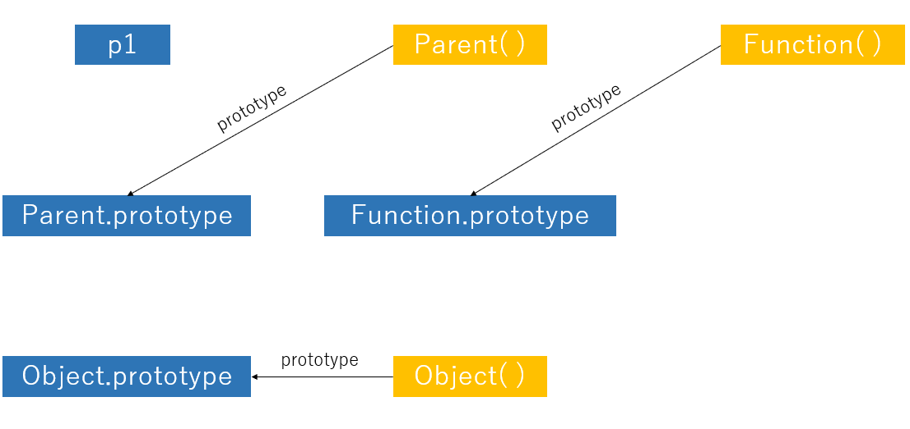
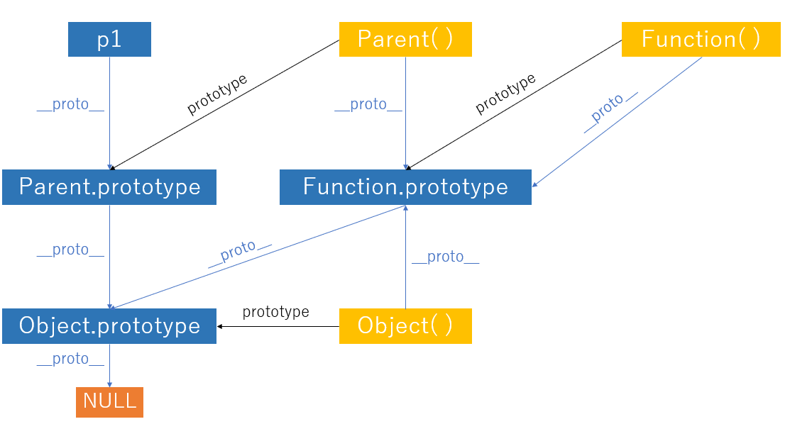
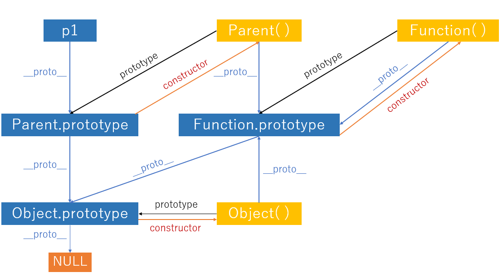

# 原型和原型链


## 前言

首先，以下三点需熟读并背诵全文：
1. js中 **对象** 和 **函数** 的关系，**！！！`函数是对象的一种`！！！**
2. 函数和构造函数的区别，任何函数都可以作为构造函数，但是并不能将任意函数叫做构造函数，只有当一个函数通过 `new` 关键字调用的时候才可以成为构造函数。
3. 要弄清楚原型和原型链，必须搞清楚 `__proto__`, `prototype`, `constructor`。
   * `__proto__`， `constructor` 是属性，是对象独有的。
   * `prototype` 属性是函数独有的
   * 函数是对象的一种，同样也有属性`__proto__`, `constructor`

```js
// 定义一个函数，现在它只是一个普通函数
var Parent = function(){};

// 通过 new 关键字调用它，创建一个 Parent 构造函数的实例
// Parent 现在不是普通函数，而是一个构造函数
var p1 = new Parent();
```

## prototype 属性



从图中可以看到它从一个函数只向另一个对象，代表这个对象是这个函数的原型对象，这个对象也是当前函数所创建的实例的原型对象。

`prototype` 设计之初就是为了实现继承，让由特定函数创建的所有实例共享属性和方法、有了 `prototype` 我们不需要为每一个实例创建重复的属性方法，而是将属性方法创建再构造函数的原型对象上。

```js
// 添加属性
Parent.prototype.name = "aaa";

// 添加方法
Parent.protorype.sayhello = function(){
  console.log("hello!");
};
```

## `__proto__` 属性



`__proto__` 属性是对象（包括对象）独有的。从图中可以看到 `__proto__` 属性是从一个对象指向另一个对象。

构造函数的实例就是通过 `__proto__` 属性和构造函数的原型对象上的属性和方法联系上的。

```js
p1.__prototype__ === Parent.prototype;
// true
```

* 函数的隐式对象指向 `Function.prototype`
* 构造函数原型对象的隐式原型指向了 `Object.prototype`
* 万物继承自 `Object.prototype`
* `Object.prototype` 的 `__proto__` 是 `null`，所以当访问对象中一个不存在的属性时，返回 `undefined`

## constructor 属性



原型对象 `protorype` 有一个默认的 `constructor` 属性，用于记录实例时由哪个构造函数创建。从图中看 `prototype` 对象指向的就是该对象的构造函数。

```js
Person.prototype.constructor == Person
// true

// 实例对象通过 __proto__ 访问其构造函数的原型对象获得 constructor 属性
console.log(p1.constructor);
// f Parent(){}
```

## 扩展
1. `this`的值：无论在哪里找到方法，在一个对象还是在原型中，在一个方法调用中，`this` 始终是点符号 `.` 前面的对象。

2. 在现代变成中，只有一种情况允许修改原生原型。那就是`ployfilling`。

`polyfilling` 是一个术语，表示某个方法在 `javascript` 规范中已存在。但是特定的 `javascript` 引擎尚不支持该方法，那么我们可以通过手动实现它，并用以填充内建原型。

```js
// 判断是否存在这个方法
if(!String.prototype.repeat){
  // 若不存在，就在 prototype 中添加它
  String.prototype.repeat = function(){
    // ...实现代码

    return ;
  }
}
```


3. `__proto__` 被认为是过时且不推荐使用的，这里的不推荐使用是指 `javascript` 规范中规定， `__proto__` 必须仅在浏览器环境下才能得到支持。

现代的方法有：

* `Object.create(proto, [descriptors])` —— 利用给定的 `__proto__` 作为 `Prototype` 和可选的属性描述来创建一空对象。
* `Object.getPrototypeOf(obj)` —— 返回对象 `obj` 的 `Prototype`。
* `Object.setPrototypeOf(obj, proto)` —— 将对象 `obj` 的 `Prototype` 设置为 `proto`。

4. `Object.create` 有一个可选的第二参数：属性描述器。我们可以在此处为新对象提供额外的属性。

我们可以使用 `Object.create` 来实现比复制 `for..in` 循环中的属性更强大的对象克隆方式：
```js
let clone = Object.create(Object.getPrototypeOf(obj), Object.getOwnPropertyDescriptors(obj));
```


## 参考 
[一张图搞定JS原型&原型链 : https://segmentfault.com/a/1190000021232132](https://segmentfault.com/a/1190000021232132)

[轻松理解JS 原型原型链 : https://juejin.cn/post/6844903989088092174](https://juejin.cn/post/6844903989088092174)

[现代 JavaScript 教程 : https://zh.javascript.info/](https://zh.javascript.info/)


