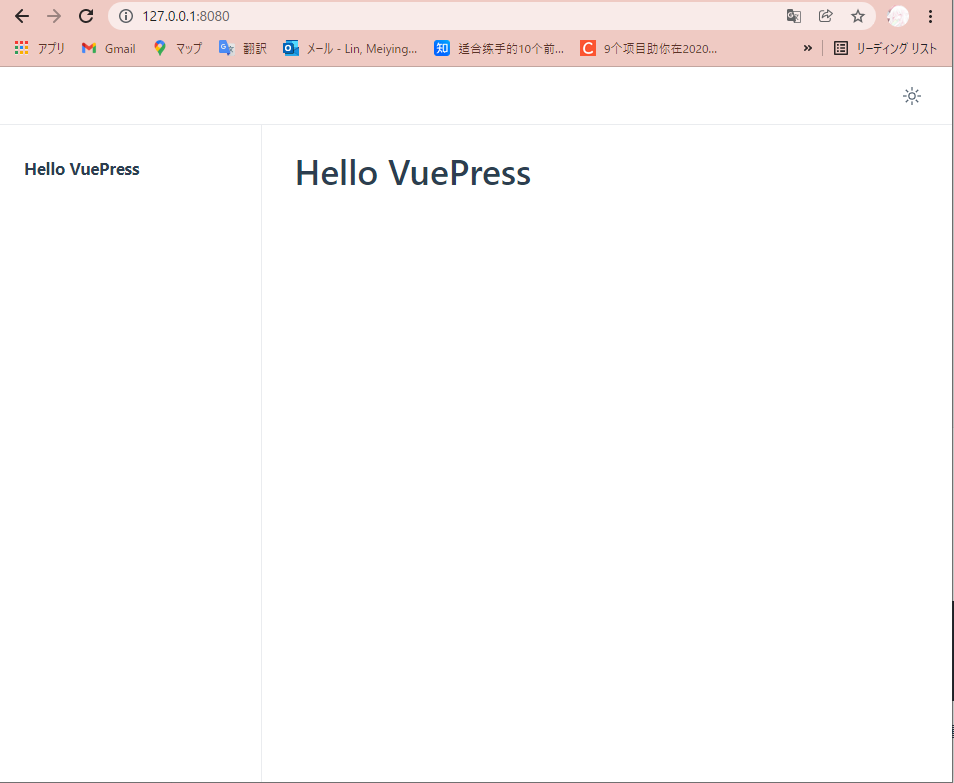
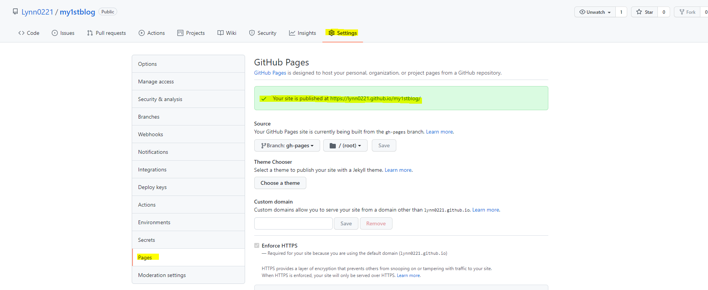
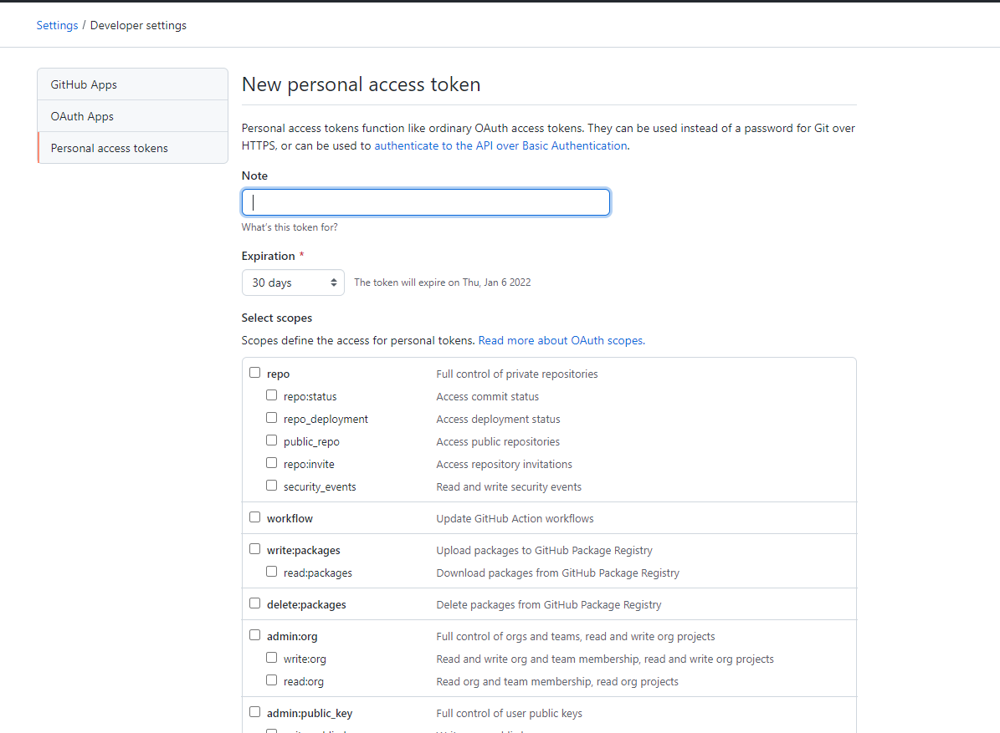
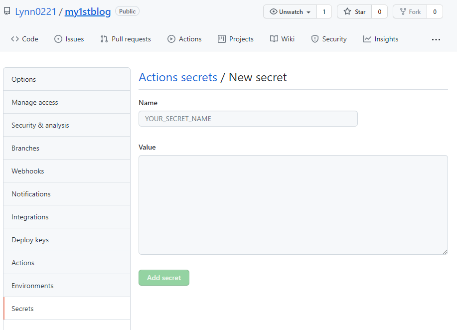
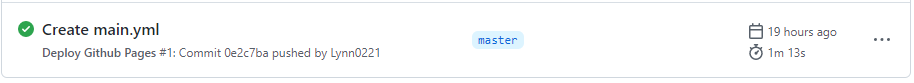

# Vuepress搭建个人博客

上班无聊摸鱼，就想写个个博玩玩，奈何还是一个小白，自己手写个前后端，实在有些难...然后就遇到了VuePress。

刚开始也只是去官方文档看一看，跟着写了写，感觉还阔以~，就真从头开始搞了一个出来，昂~就是现在看到的这个,主题就用的默认的...

写这一篇，纯粹就是为了巩固一下，希望有一天我也能自己写个 主题API 出来哈...

嗯 Come on！！开始复习...

## Vuepress简单介绍
VuePress 是一个以 Markdown 为中心的静态网站生成器。

VuePress 的初衷是为了支持 Vue.js 及其子项目的文档需求，但是现在越来越多的使用 VuePress 构建他们的文档，博客和其他静态网站。

详细参考：
[Vuepress 官方文档](https://v2.vuepress.vuejs.org/zh/guide/)

## 搭建
### 安装

**创建目录**
```sh
mkdir myblog  
cd myblog
```
**初始化**
```sh
git init
npm init
```

**本地安装 VuePress**
```sh
npm install -D vuepress@next
```
> 我当时是装的最新版本 `2.0.0-beta.27` 有个路径的坑，不知道修复了没...

**在`package.json`中添加配置**
```js
{
  "scripts": {
    "docs:dev": "vuepress dev docs",
    "docs:build": "vuepress build docs"
  }
}
```
**配置`.gitignore`**  
把默认的`node_modules`,`.temp`,`.cache`和其他一些不想推到git上的文件列出来就好。
```sh
echo 'node_modules' >> .gitignore
echo '.temp' >> .gitignore
echo '.cache' >> .gitignore
```
> 我用上述代码的时候踩了编码问题的坑，感觉手动添加就好，比写代码也没麻烦多少...


**创建第一篇文档**
```sh
mkdir docs
echo '# Hello VuePress' > docs/README.md
```
创建`docs`文件夹，创建`README.md`，编辑`Hello VuePress`

**运行**
```sh
npm run docs:dev
```



到此，安装加初期设置和开始仪式都完成了！

### 页面
项目结构大概是这样的
```
├─ docs
│  ├─ .vuepress
│  │  └─ config.js       -> 配置文件，包括博客标题，描述等等信息
│  │  └─ public          -> 静态资源，图片等
│  ├─ guide              -> 页面
│  └─ README.md          -> 主页
├─ .gitignore
└─ package.json
```

其中最重要的是`config.js`文件，它导出js对象
```js
module.exports = {
  lang: 'zh-CN',
  title: '你好， VuePress ！',
  description: '这是我的第一个 VuePress 站点',

  themeConfig: {
    logo: 'https://vuejs.org/images/logo.png',
  },
}
```
详细配置项可以参考：[VuePress参考——配置](https://v2.vuepress.vuejs.org/zh/reference/config.html#%E7%AB%99%E7%82%B9%E9%85%8D%E7%BD%AE)

> 上文提到一次最新版本的坑，即使这里，在设置`base`配置项时，之前1的版本都是 `base` 作为前缀自动地插入到所有以 / 开始的其他选项的链接中，但是设置 tab 图标的路径的时候（`head`配置项的`href`）加不上去，只能手动添加...
> ```js
> module.exports = {
> base: "/my1stblog/",
> lang: "zh-CN",
> title: "Lynn's Blog",
> description: "This is my first blog!",
> head: [['link', { rel: 'icon', href: '/my1stblog/favicon.ico' }]],
> ```

在 `config.js` 里有一个`themeConfig` 配置项。在 `themeConfig` 外部的配置项属于 **站点配置** ，而在 `themeConfig` 内部的配置项则属于 **主题配置**。

站点配置就是无论使用什么主题，这些配置项都可以生效，比如`lang`，`title`等等。

主题配置取决于你使用的主题是什么。  
这里就推一个比较火的一个主题  [vuepress-theme-reco](https://vuepress-theme-reco.recoluan.com/)  
此外也有很多，也可以开发一个，具体参考官方文档 https://v2.vuepress.vuejs.org/zh/guide/theme.html#%E6%9C%AC%E5%9C%B0%E4%B8%BB%E9%A2%98


另外，对于每个 `Markdown` 文件可以包含一个 YAML Frontmatter。Frontmatter 必须在文件的顶部。通过 Frontmatter 覆盖站点配置的一些配置项。Frontmatter 可以当作页面级作用域的配置。
```md
---
lang: zh-CN
title: 页面的标题
description: 页面的描述
---

## hello vuepress
```


### 路由
默认情况下，页面的路由路径是根据 `Markdown` 文件的相对路径决定的。

假设文件所处的目录结构是这样的：
```
└─ docs
   ├─ guide
   │  ├─ getting-started.md
   │  └─ README.md
   ├─ contributing.md
   └─ README.md
```
将 `docs` 目录作为 `sourceDir`

| 相对路径           | 路由路径           |
| ------------------ | ------------------ |
| `/README.md`       | `/`                |
| `/contributing.md` | `/contributing.md` |
| `/guide/README.md` | `/guide/`          |
| `guide/page.md`    | `/guide/page.html` |


## 部署
### Github Pages
`Github Pages`是一个静态站点托管服务。Github 页面旨在直接从 Github 仓库中直接托管个人，组织或项目页面。

### 手动部署
```sh
# 项目打包 (package.json 里设置的打包命令)
npm run docs:build

# 进入生成的文件夹
cd .\docs\.vuepress\dist\

# 提交，推送到 gh-pages 分支（分支名称固定 gh-pages）
git init
git add -A
git commit -m "deploy"

# 如果发布到 https://<USERNAME>.github.io
# git push -f git@github.com:<USERNAME>/<USERNAME>.github.io.git master

# 如果发布到 https://<USERNAME>.github.io/<REPO>
# git push -f git@github.com:<USERNAME>/<REPO>.git master:gh-pages

# 把上面的 <USERNAME> 换成你自己的 Github 用户名，<REPO> 换成仓库名，比如我这里就是：
git push -f https://github.com/Lynn0221/my1stblog.git master:gh-pages
```

**这里需要注意的是 `config.js` 文件里的 `base` 要设置为 "`/<REPO>/`"**

上述代码，手动一行一行运行或者新建脚本，如`deploy-gh.sh` 通过运行`npm run deply-gh.sh`部署都是可以的。

接着，回到 github 点击`settings`,选择 `pages`,就可以看到部署后的 Github Pages 地址。



### Github Actions 自动部署
更新多了，我们就会发现手动部署很麻烦。只是增加了个博文，又要打包，又要上传的，就很希望能够自动部署。然后就找到了 `Github Actions`。

使用`Github Actions`之后，只要 master 分支上有新的提交，就会自动部署。

1. 首先需要一个 `Access Token`
   进入个人主页的`settings` --> `Developer settings` --> `Personal access tokens` --> `Generate new token`

   

 Note：ACCESS_TOKEN  
 Expiration：选择有效期限  
 Select scopes：因为要操作仓库，关于 repo 的全选，其他的随意。  
 最后生成`token`,这个之后还要用到！！！！

2. 回到项目仓库，进入`Settings` --> `Secrets`
   
   
   
   Name: ACCESS_TOKEN  
   Value: token值

3. 回到项目仓库，进入`Actions` --> `New workflow` --> `Set up this workflow`
   自定义名称 比如`main.yml`
  
  ```
  # This is a basic workflow to help you get started with Actions

  name: Deploy Github Pages

  # Controls when the workflow will run
  on:
    # Triggers the workflow on push or pull request events but only for the master branch
    push:
      branches: [ master ]

    # Allows you to run this workflow manually from the Actions tab
    workflow_dispatch:

  # A workflow run is made up of one or more jobs that can run sequentially or in parallel
  jobs:
    # This workflow contains a single job called "build"
    build:
      # The type of runner that the job will run on
      runs-on: ubuntu-latest

      # Steps represent a sequence of tasks that will be executed as part of the job
      steps:
        # Checks-out your repository under $GITHUB_WORKSPACE, so your job can access it
        - name: Checkout
          uses: actions/checkout@v2
          with: 
              persist-credentials: false

        # Runs a single command using the runners shell
        - name: Build
          run: npm install && npm run docs:build

        # Runs a set of commands using the runners shell
        - name: Deploy
          uses: JamesIves/github-pages-deploy-action@releases/v3
          with: 
            ACCESS_TOKEN: ${{ secrets.ACCESS_TOKEN }}
            BRANCH: gh-pages
            FOLDER: docs/.vuepress/dist
   ``` 

   

   这样就配置好了~！